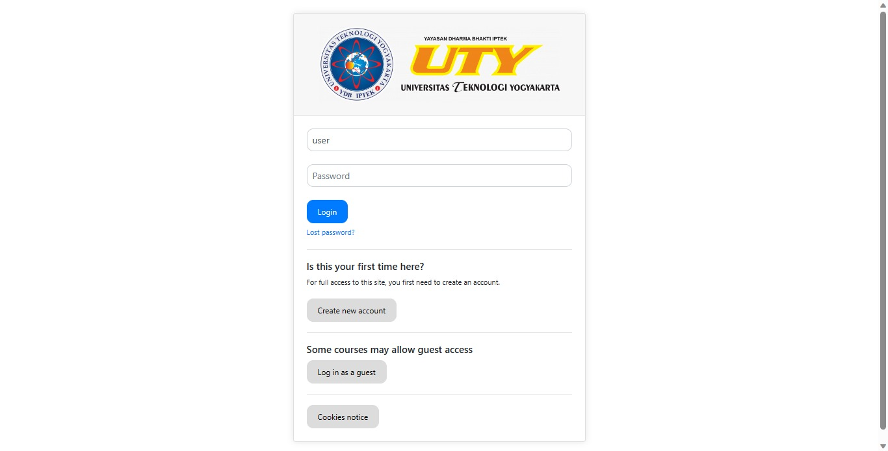
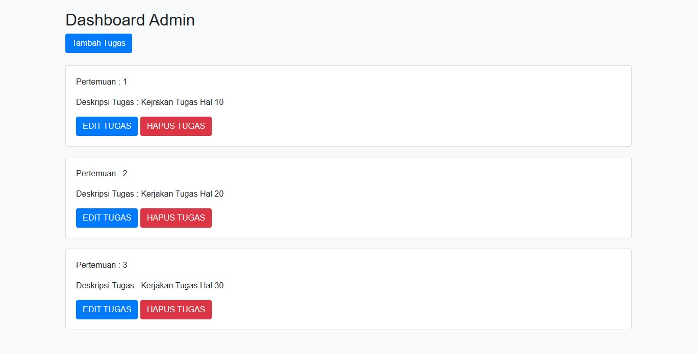
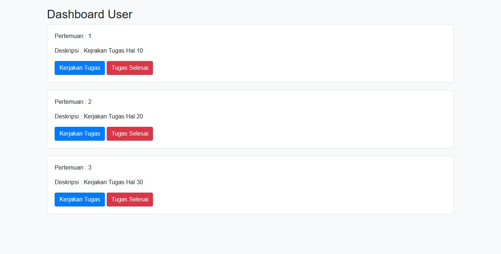
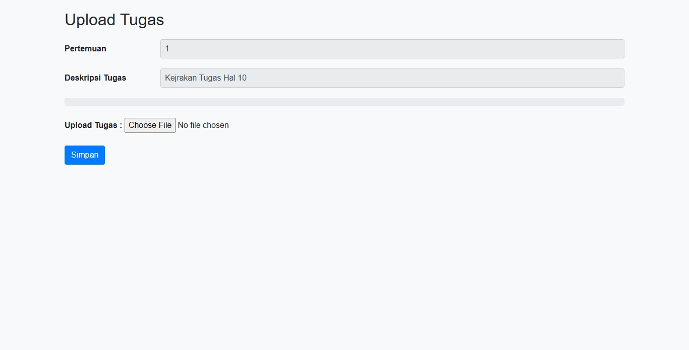
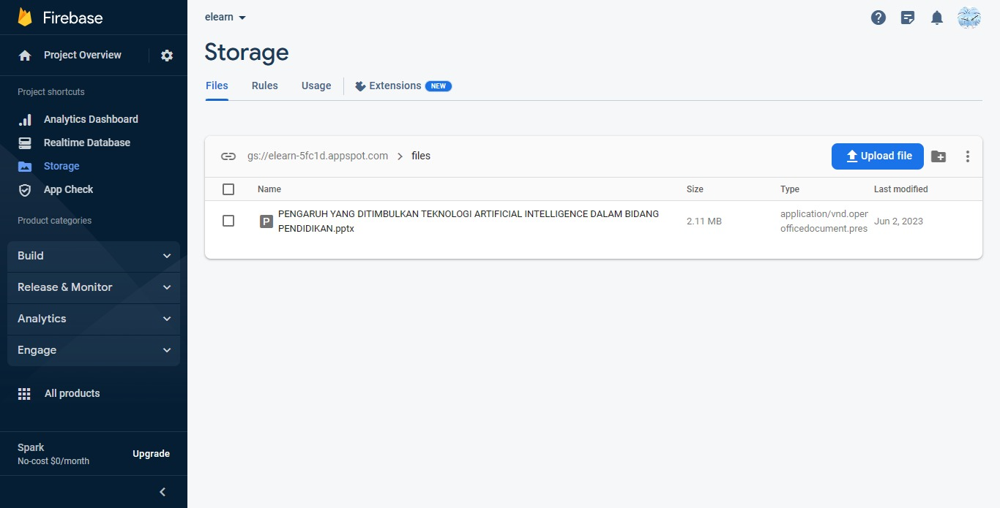
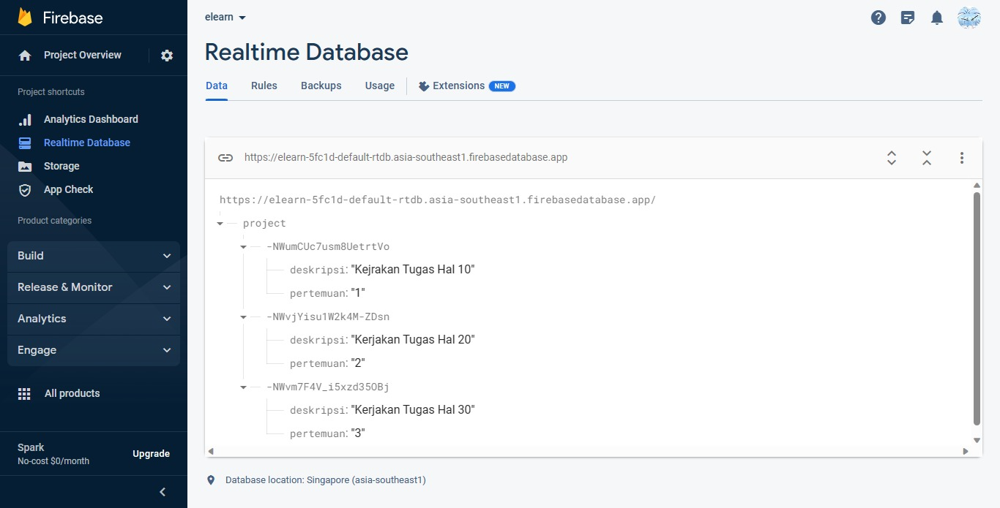

  <h1>Simple CRUD PHP Firebase</h1>

Membuat CRUD dengan menggunakan bahasa permograman PHP dan database Firebase

Link : 
 
  <a href="http://crud-admin.infinityfreeapp.com/admin/login.php">Login Admin</a>
 
  <a href="http://crud-user.infinityfreeapp.com/user/login.php">Login User</a>

<h2>Tampilan Web dan Database</h2>

  <table>
    <tr>
      <td>
        <h6>Login</h6>
        
      </td>
      <td colspan="2">
        <h6>Dashboard Admin</h6>
        
      </td>
    </tr>
    <tr>
      <td>
        <h6>Tambah Tugas Admin</h6>
        
      </td>
      <td>
        <h6>Dashboard User</h6>
        
      </td>
    </tr>
    <tr>
      <td>
        <h6>Upload Tugas User</h6>
        
      </td>
    </tr>
    <tr>
      <td>
        <h6>Storage Firebase</h6>
        
      </td>
      <td>
        <h6>Realtime Database Firebase</h6>
        
      </td>
    </tr>
    
  </table>

